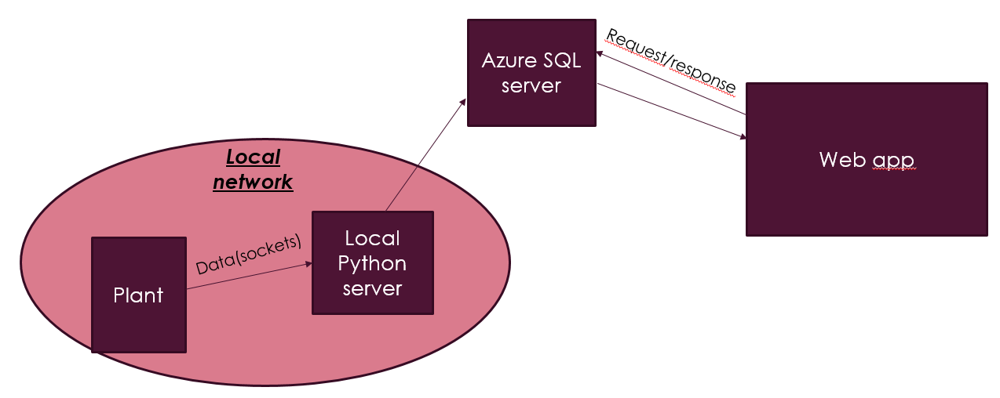
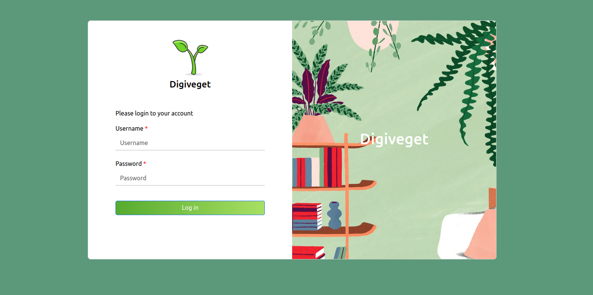
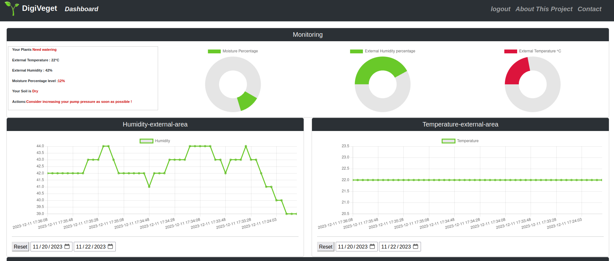
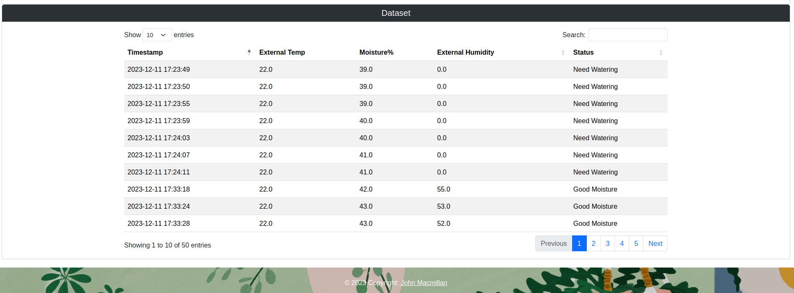
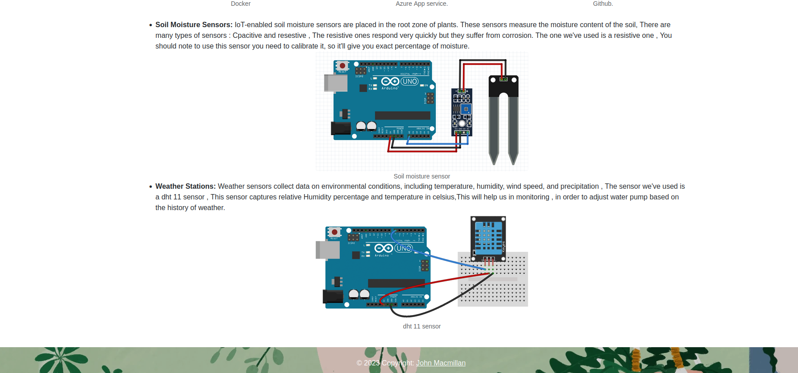
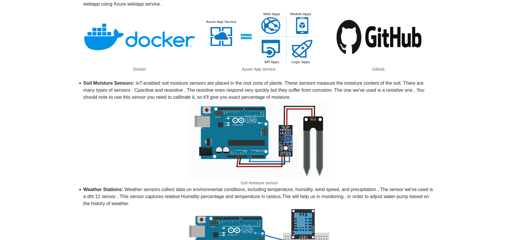

# Digiveget-app
Monitoring System for smart Agriculture using Flask,Azure services . 

- Architecture of the SYstem : 

 
- Login Page :  

 
- Dashboard :  

 
- Interactive Table : 

- About Section : 

 

